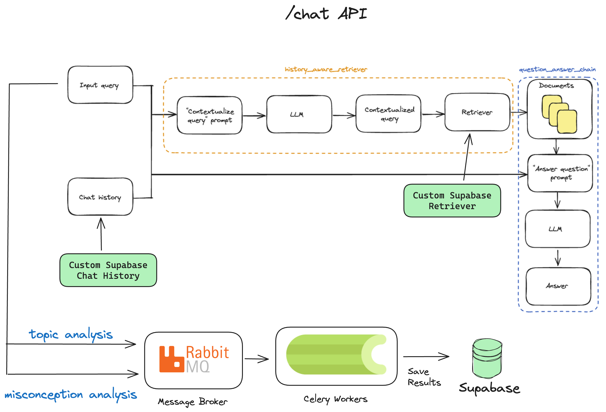

# Lanvas Backend

This repo contains the code for the backend of [Lanvas](https://github.com/13point5/lanvas-frontend).

Tech Stack:

- [Python](https://www.python.org/) - Language
- [FastAPI](https://fastapi.tiangolo.com/) - API Framework
- [Supabase](https://supabase.com/) - Database, Auth, Storage, Vectorstore
- [LangChain](https://python.langchain.com/v0.2/docs/introduction/) - LLM Framework
- [OpenAI](https://openai.com/) - LLM
- [Instructor](https://python.useinstructor.com/) - Structured Output Generation
- [RabbitMQ](https://www.rabbitmq.com/) - Message Broker
- [Celery](https://docs.celeryq.dev/en/stable/) - Task Queue
- [PyTest](https://docs.pytest.org/en/8.2.x/) - Testing Framework

## Architecture



The architecture for the chat API is based on the Official LangChain guide for [RAG with Chat History](https://python.langchain.com/v0.2/docs/how_to/qa_chat_history_how_to/) with a few modifications.

Since Supabase is the database and vectorstore for Lanvas, there is a `Custom Retriever` and `ChatHistory` to make the chain work.

Celery is used to handle analytics tasks that aggregate the following:

1. Topics discussed by a student
2. Misconceptions of a student

The analysis is powered by Instructor and OpenAI's GPT LLM.

## Setup

1. Install [poetry](https://python-poetry.org/docs/#installation)

1. Install dependencies using poetry

   ```bash
   poetry install
   ```

1. Install and setup [RabbitMQ](https://docs.celeryq.dev/en/stable/getting-started/backends-and-brokers/rabbitmq.html#broker-rabbitmq)

1. Install [Supabase CLI](https://supabase.com/docs/guides/cli/getting-started)

1. [Create](https://supabase.com/dashboard/projects) a new Supabase project using the dashboard

1. Link with the newly created Supabase project

   ```bash
   supabase link --project-ref ""
   ```

1. Setup Tables and Functions with migrations in the `supabase/migrations/` directory

   ```bash
   supabase db push
   ```

1. Setup `.env` file

   ```bash
   cp .env.sample .env
   ```

1. Activate virtual environment

   ```bash
   poetry shell
   ```

1. Setup Celery worker

   ```bash
   celery -A celery_tasks worker -l INFO
   ```

1. Start the FastAPI server

   ```bash
   uvicorn main:app --reload
   ```

1. Visit the docs at `http://localhost:8000/docs`

## Tests

There are a few unit tests setup which you can verify by running the following command:

```bash
poetry run pytest -s
```
